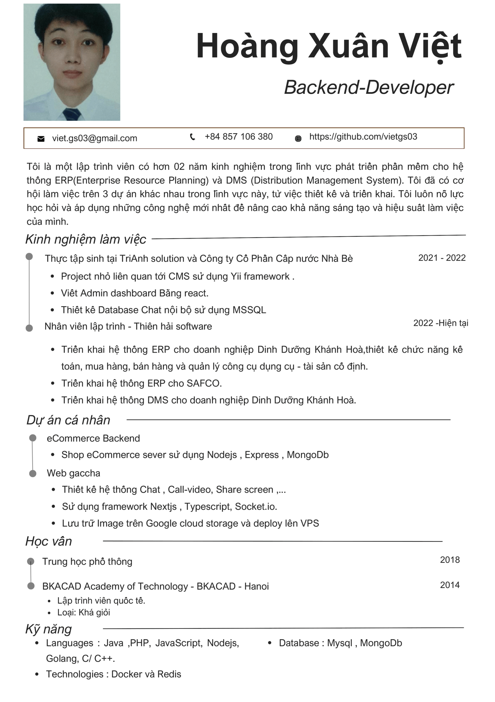

<h1 align="center">Hi 👋, I'm Hoàng Xuân Việt</h1>
<h3 align="center">A self-taught programmer and I've been through a lot of mistakes</h3>

- 🔭 I’m currently working at [Thien Hai Software](https://thienhaisoft.com/)

- 🌱 I’m currently learning **Flutter, English, Microservices, Golang, and backend technologies...**

- 👯 I’m looking to collaborate with **other content creators and developers**

- ⚡ Fun fact: **I love to play Soccer and enjoy Chai over coffee.**

### Connect with me:

 

### Languages

 Java
 NodeJS
 Golang
 C & C++
 Javascript
 PHP
 Flutter

### Technologies
 Kafka
 RabbitMQ

### Databases
MariaDB
PostgreSQL
MongoDB
MySQL

### DevOps
<!-- Add your DevOps skills here -->

### Most Used Languages

 
 
 
 
 
 
 
 

### GitHub Stats

&nbsp;

### Preview

