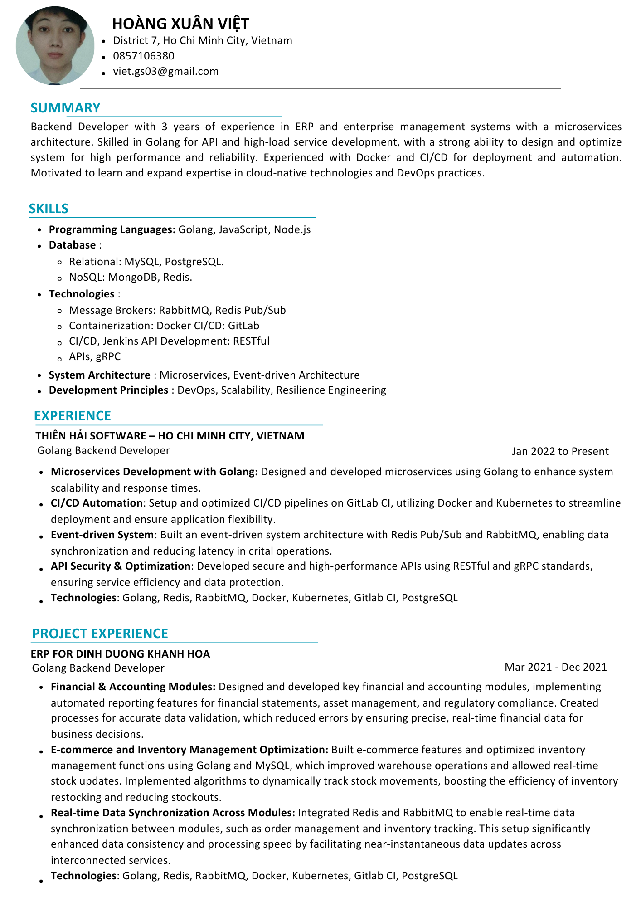
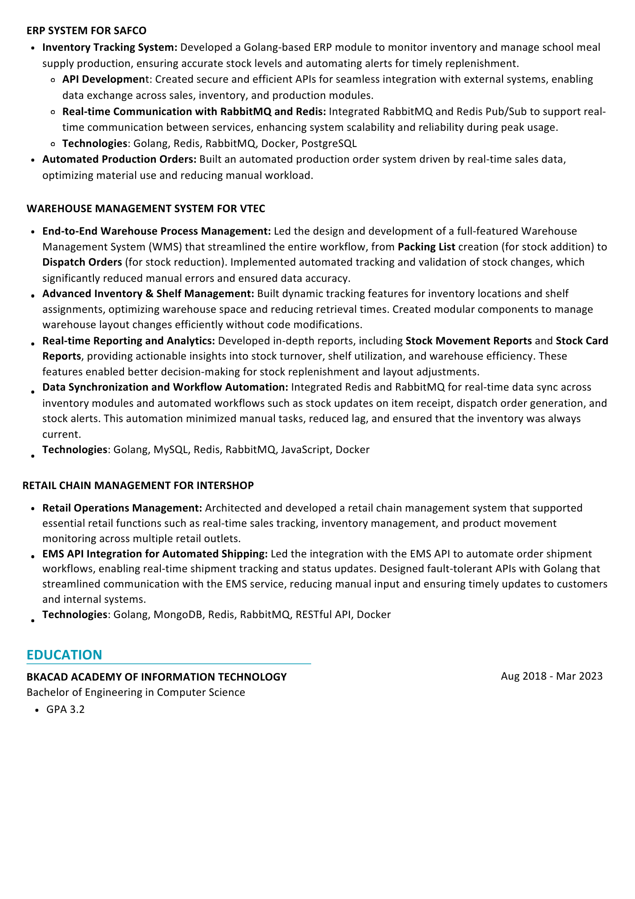

# 🌟 **Hoàng Xuân Việt** — Crafting Scalable Software Solutions  

### 🚀 Senior Fullstack Developer | Architecting Microservices | Building Impactful ERP Systems  

---

## 👨‍💻 **About Me**  

I am a passionate **Senior Fullstack Developer** with over **3 years of professional experience**, dedicated to building **high-performance web applications** and delivering business-critical systems. My expertise lies in developing **ERP platforms**, **eCommerce microservices**, and **warehouse management systems**, blending clean architecture with robust performance optimization techniques.  

- 🎯 I thrive in environments where **efficiency** and **scalability** are key.  
- 💡 I specialize in **problem-solving complex system challenges** and aligning technology with business goals.  
- 🌍 I continuously explore **cutting-edge tools** like **Golang**, **Redis**, and **Docker**, while staying rooted in tried-and-true systems like **PHP** and **Node.js**.  
- 💼 My professional mantra: *"Good software solves problems; great software creates opportunities."*  

---

## 🏆 **Key Achievements**  

### 🚚 **Warehouse Management Systems**  
- 📌 Delivered a **scalable ERP solution** for **Việt Tiến - Vtec**, automating the tracking of raw materials, production outputs, and inventory data.  
- 🔄 Designed APIs to import complex datasets such as **packing lists**, **inspection reports**, and manual records, ensuring **100% data accuracy**.  
- 📈 Optimized database performance, reducing query time by **30%** through advanced indexing and query refactoring.

### 🎁 **QR Code-Based Prize Redemption System**  
- 📱 Developed a gamified **QR code-based prize redemption platform** for **Glico Vietnam**, allowing customers to win prizes instantly via QR scans.  
- 🤝 Collaborated with **Fibo Services** to enable seamless **real-time financial transactions** to users' SIM cards, ensuring a 100% uptime experience.  
- 🏆 Achieved user engagement rates **30% higher** than forecasted through intuitive UI and secure backend logic.

### 💰 **Accounting ERP for Manufacturing**  
- 🔎 Built a **comprehensive accounting system** for **Dinh Dưỡng Khánh Hòa**, automating financial reports, tracking assets, and reconciling inventory in real time.  
- 📊 Designed workflows for **purchase order management**, integrating seamlessly with warehouse and production modules to boost operational efficiency.

---

## 💼 **Professional Skill Set**  

### 🔧 **Technical Expertise**  
- **Languages**:  
    
    
    
    

- **Databases**:  
    
    
    

- **DevOps Tools**:  
    
    
    

### 📚 **Specializations**  
- **Microservices Architecture**: Designing loosely coupled, scalable, and maintainable services for modern applications.  
- **ERP Systems**: End-to-end development of modules for accounting, inventory, and production management.  
- **Performance Optimization**: Expertise in **query optimization**, **batch processing**, and minimizing **service downtime**.  

---

## 🌟 **Notable Projects**  

### 1. **ERP for Việt Tiến - Vtec**  
- Automated the entire production lifecycle from **raw materials** to finished goods.  
- Built high-performance APIs for real-time inventory tracking and reconciliation.  
- Enhanced operational productivity by **20%** through system integration and optimization.

### 2. **ECommerce Microservices Platform**  
- Designed a **microservices architecture** for a marketplace with independent services for user management, order processing, and payment integration.  
- Leveraged **RabbitMQ** for asynchronous task handling and **Redis** for caching, reducing API response times by **40%**.  

### 3. **QR Prize Redemption**  
- Built from the ground up, ensuring **secure data flows** between users, servers, and third-party payment providers.  
- Achieved **zero downtime** during the campaign, processing over **50,000 QR scans** daily.  

---

## 📈 **GitHub Stats**  

  

---

## 📬 **Let's Connect**  
I love connecting with like-minded developers and exploring new ideas! Feel free to reach out:  

- 🌐 [GitHub](https://github.com/vietgs03)  
- 📧 [Email](mailto:viet.gs03@gmail.com)  
- 💼 [LinkedIn](https://linkedin.com/in/vietgs03)  

---

## ⚡ **Fun Fact**  
When I’m not writing code, I’m either **playing football ⚽**, **brewing coffee ☕**, or tinkering with **new technologies 🔧** just for fun!

